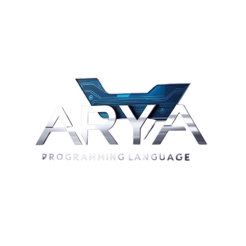

# 🌟 Arya Programming Language 🌟  

[](https://github.com/david0154/Arya)  
[](https://github.com/david0154/Arya/blob/main/LICENSE)  
[](https://github.com/david0154/Arya)  
[](https://github.com/david0154/Arya)  
[](https://github.com/david0154/Arya/pulls)  
[](https://github.com/david0154/Arya)

  

<br> 


[](https://github.com/david0154/Arya)

**Developer:** David  
**Email:** [📧 davidk76011@gmail.com](mailto:davidk76011@gmail.com)  
**Location:** 🌍 India 🇮🇳  

---

## 🔥 Introduction  

**Arya** is a revolutionary programming framework that consolidates **PHP**, **Python**, **JavaScript**, **HTML**, **Java**, **Go**, **C**, and **Rust** into a single, cohesive language. Designed to enhance the developer experience, Arya integrates powerful cross-platform capabilities, automatic library management, and built-in server support tools like **Nginx**, **Apache**, and **DNS configuration**, including **Let's Encrypt** for easy SSL setup. Once the initial setup is done, **Arya** operates **100% offline**, providing developers with a fully functional environment even without an internet connection.


## ✨ Key Features  

- **Seamless Multi-Language Integration:**  
  Arya supports a wide range of languages, including **PHP**, **Python**, **JavaScript**, **Go**, **C**, **Java**, **Rust**, and **HTML**. This allows you to leverage the strengths of each language within a single unified framework, making cross-language development more efficient and less cumbersome.  

- **True Cross-Platform Support:**  
  Arya seamlessly runs on all major operating systems, including **Linux**, **Windows**, and **macOS**, ensuring your applications and projects are portable and easily manageable regardless of the platform.  

- **Work Offline, Always:**  
  Once installed, Arya runs fully **offline**, empowering you to work in environments with limited or no internet access, making it perfect for developers who need reliable, offline functionality.  

- **Automatic Library Management:**  
  Arya automatically handles library dependencies and ensures you always have the right libraries from trusted official sources. You don’t need to manually track versions or resolve conflicts, streamlining the development process.  

- **Comprehensive Server Tools:**  
  Arya comes equipped with powerful server management tools such as **Nginx**, **Apache**, **DNS configuration**, and **Let’s Encrypt SSL** setup. These tools ensure that your web applications are secure, stable, and easily deployable without needing third-party services.

## 🔧 Arya’s Own Library System

Arya introduces an advanced **library management system** that goes beyond traditional language-specific libraries. Arya's framework unifies libraries across different languages, allowing you to manage and share libraries across **PHP**, **Python**, **JavaScript**, **Go**, **C**, **Java**, **Rust**, and **HTML** within a single integrated system. This eliminates the usual barriers between languages and makes it incredibly easy to switch or integrate languages within your projects. 

By using **Arya language libraries**, you ensure that all dependencies are handled efficiently, minimizing version conflicts and providing a consistent development experience across languages. Whether you are developing in **Python** for machine learning or **PHP** for web applications, Arya optimizes your workflow and ensures smooth interoperability between languages and libraries.

---

## 🚀 Installation  

### 📌 For Linux (Ubuntu, Debian, CentOS)  

1. **Clone the repository:**  
   ```bash
   git clone https://github.com/david0154/Arya.git
   cd Arya

2. **Run the installation script:**
      ```bash
   sudo bash install.sh


This script will install all necessary dependencies and libraries for Arya.


---

📌 For Windows

1. **Clone the repository:**
   ```bash
   git clone https://github.com/david0154/Arya.git cd Arya


2. Run the PowerShell installation script:
   ```bash
      .\install.ps1

This script will install all necessary dependencies and libraries for Arya on Windows.


---

###📌 For macOS

1. **Clone the repository:**
   ```bash
    git clone https://github.com/david0154/Arya.git
   cd Arya


2. Run the macOS installation script:
   ```bash
   sudo bash install.sh

This script will install all necessary dependencies and libraries for Arya on macOS.


---

🎯 Usage Instructions
  ### arya Run a `.aya` File  
```bash
arya run myfile.aya
```

### arya Compile a `.aya` File  
```bash
arya compile myfile.aya
```

### arya Check Arya Version  
```bash
arya --version
```

### arya Get Help  
```bash
arya --help
```

### arya List Installed Libraries  
```bash
arya list-libs
```

### arya Install a Specific Library  
```bash
arya install <library-name>
```

### arya Update Arya  
   ```bash
   arya update

  
```


🌐 Server Configuration

Arya supports automatic server configuration with Apache and Nginx, including SSL setup using Let's Encrypt.


---

❓ Troubleshooting

Installation fails: Ensure required tools like curl, git, and bash are installed.

Cannot run .aya files: Verify Arya is installed and available in your PATH.


---

🤝 Contribution

We welcome contributions! If you'd like to contribute to Arya, please fork the repository, create a branch, and submit a pull request.
Here’s how you can contribute:

1. Fork the repository.


2. Create a new branch (git checkout -b feature-branch).


3. Make your changes.


4. Commit the changes (git commit -am 'Add new feature').


5. Push to the branch (git push origin feature-branch).


6. Create a new pull request.


---

📄 License

Arya is open-source and licensed under the MIT License. See the LICENSE file for details.


---

🌟 Happy Coding with Arya! 🌟


---

LICENSE File (MIT License):

MIT License

Copyright (c) 2025 David

Permission is hereby granted, free of charge, to any person obtaining a copy  
of this software and associated documentation files (the "Software"), to deal  
in the Software without restriction, including without limitation the rights  
to use, copy, modify, merge, publish, distribute, sublicense, and/or sell  
copies of the Software, and to permit persons to whom the Software is  
furnished to do so, subject to the following conditions:

The above copyright notice and this permission notice shall be included in all  
copies or substantial portions of the Software.

THE SOFTWARE IS PROVIDED "AS IS", WITHOUT WARRANTY OF ANY KIND, EXPRESS OR  
IMPLIED, INCLUDING BUT NOT LIMITED TO THE WARRANTIES OF MERCHANTABILITY,  
FITNESS FOR A PARTICULAR PURPOSE AND NONINFRINGEMENT. IN NO EVENT SHALL THE  
AUTHORS OR COPYRIGHT HOLDERS BE LIABLE FOR ANY CLAIM, DAMAGES, OR OTHER  
LIABILITY, WHETHER IN AN ACTION OF CONTRACT, TORT OR OTHERWISE, ARISING FROM,  
OUT OF OR IN CONNECTION WITH THE SOFTWARE OR THE USE OR OTHER DEALINGS IN THE  
SOFTWARE.
